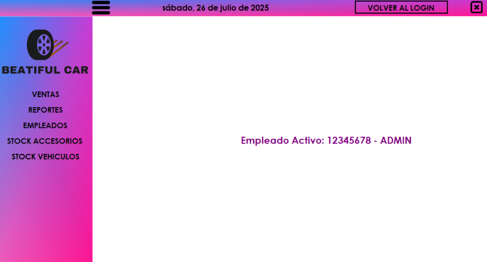
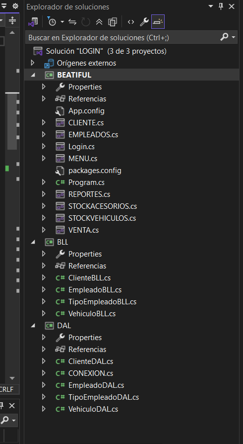
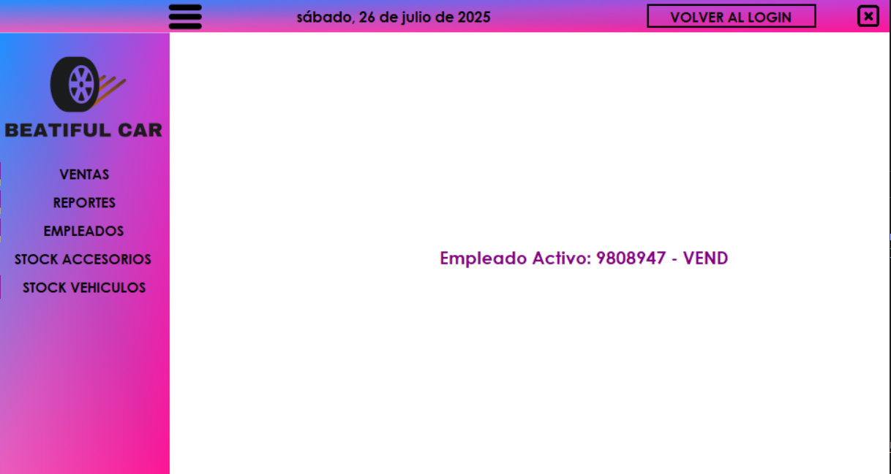
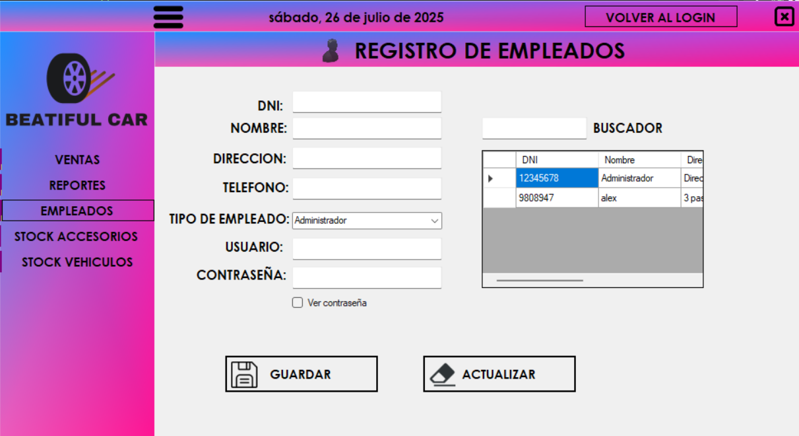
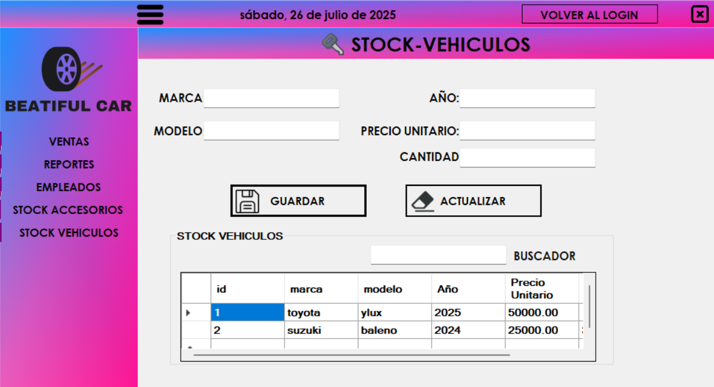
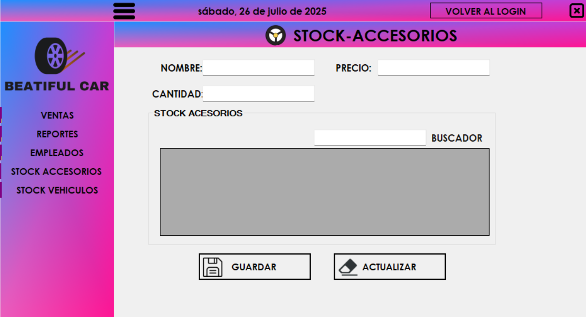

# Sistema de Gestión y Control de Ventas 🚀
<div align="center">


[](https://opensource.org/licenses/MIT)
[](https://visualstudio.microsoft.com/)
[](https://www.microsoft.com/sql-server)
[](https://docs.microsoft.com/dotnet)

*Un sistema integral de gestión empresarial desarrollado con las últimas tecnologías .NET*


</div>

---

## 📑 Tabla de Contenidos
- [Sobre el Proyecto](#-sobre-el-proyecto)
- [Arquitectura del Sistema](#-arquitectura-del-sistema)
- [Tecnologías Utilizadas](#%EF%B8%8F-tecnologías-utilizadas)
- [Características](#-características)
- [Comenzando](#-comenzando)
- [Uso](#-uso)
- [Documentación](#-documentación)
- [Roadmap](#-roadmap)
- [Contribuir](#-contribuir)
- [Licencia](#-licencia)
- [Contacto](#-contacto)

## 🎯 Sobre el Proyecto

<div align="center">
  
</div>

Sistema integral desarrollado en C# con arquitectura en capas para la gestión empresarial, incluyendo:
- Sistema de autenticación robusto
- Gestión de empleados y roles
- Control de inventario
- Sistema de ventas
- Gestión de clientes
- Reportes y análisis

## 🏗 Arquitectura del Sistema

<div align="center">
  
</div>

El sistema está construido siguiendo una arquitectura en capas:
- **Capa de Presentación (UI)**: Interfaces de usuario modernas con Bunifu UI
- **Capa de Lógica de Negocio (BLL)**: Reglas de negocio y validaciones
- **Capa de Acceso a Datos (DAL)**: Interacción con la base de datos
- **Base de Datos**: SQL Server con procedimientos almacenados optimizados

## 🛠️ Tecnologías Utilizadas

<div align="center">

| Tecnología | Versión | Uso |
|------------|---------|-----|
| C# | 7.0+ | Lenguaje principal |
| .NET Framework | 4.7.2+ | Framework de desarrollo |
| SQL Server | 2019 | Base de datos |
| Bunifu UI | 5.0.6 | Framework de UI |
| Visual Studio | 2019+ | IDE |

</div>

## ✨ Características

### Módulo de Autenticación
<div align="center">
  
</div>

- Sistema de login seguro
- Gestión de roles y permisos
- Recuperación de contraseña
- Registro de actividad

### Gestión de Empleados
<div align="center">
  
</div>
<div align="center">
  
</div>

- Alta, baja y modificación de empleados
- Asignación de roles
- Control de accesos
- Historial de actividades

### Control de Inventario
<div align="center">
  
</div>
<div align="center">
  
</div>

- Gestión de vehículos
- Control de stock
- Alertas de inventario bajo
- Registro de movimientos

## 🚀 Comenzando

### Prerrequisitos
```powershell
# Verificar versión de .NET
dotnet --version

# Verificar SQL Server
sqlcmd -?
```

### Instalación

1. Clonar el repositorio
```powershell
git clone [URL_DEL_REPOSITORIO]
```

2. Configurar la base de datos
```sql
-- Ejecutar en SQL Server Management Studio
USE master
GO
CREATE DATABASE BEATIFUL
GO
```

3. Configurar la conexión
```xml
<!-- App.config -->
<connectionStrings>
  <add name="DefaultConnection" 
       connectionString="Server=localhost;Database=BEATIFUL;Trusted_Connection=True;"
       providerName="System.Data.SqlClient" />
</connectionStrings>
```

## 📖 Documentación

Documentación detallada disponible en la [Wiki del proyecto](../../wiki)

## 🗺 Roadmap

- [x] Sistema base de autenticación
- [x] Gestión de empleados
- [x] Control de inventario
- [ ] Sistema de reportes avanzados
- [ ] Integración con APIs externas
- [ ] Dashboard en tiempo real

## 🤝 Contribuir

Las contribuciones son bienvenidas. Por favor, lee [CONTRIBUTING.md](CONTRIBUTING.md) para más detalles.

## 📄 Licencia

Distribuido bajo la Licencia MIT. Ver [LICENSE.md](LICENSE.md) para más información.

## 📫 Contacto

Alex Jhail Sanchez Rea - [@AlexJhailSanchezRea](https://github.com/AlexJhailSanchezRea)

---

<div align="center">

**¿Te gustó el proyecto? Dale una ⭐️**

</div>

<!-- 
Instrucciones para las imágenes:
1. Crear un logo para el proyecto y guardarlo en docs/images/icons/logo.png
2. Tomar screenshots de cada módulo principal y guardarlos en docs/images/screenshots/
3. Crear el diagrama de arquitectura y guardarlo en docs/images/diagrams/architecture.png
4. Asegurarse de que todas las imágenes tengan un tamaño y formato consistente
--> 